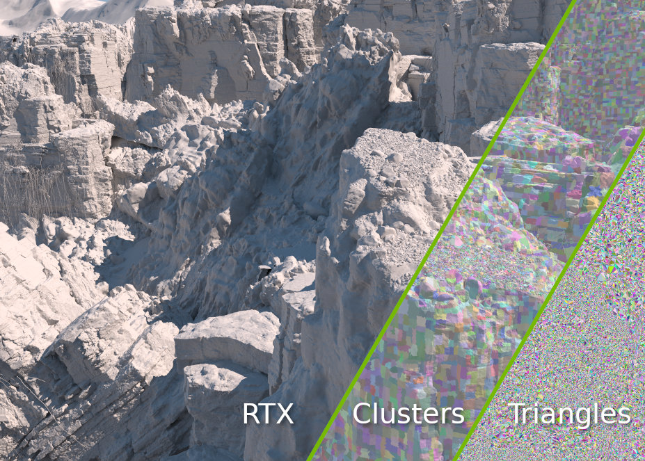

# Streaming and Ray Tracing Continuous Level of Detail



This is a Vulkan app that renders large scenes with real time ray tracing using
NVIDIA RTX Mega Geometry. It streams continuous level of detail, like [Nanite's
virtual
geometry](https://dev.epicgames.com/documentation/en-us/unreal-engine/nanite-virtualized-geometry-in-unreal-engine)
but for ray tracing.

Other RTX Mega Geometry samples:

- [RTX Mega Geometry](https://github.com/NVIDIA-RTX/RTXMG)
- [vk_lod_clusters](https://github.com/nvpro-samples/vk_lod_clusters)
- [vk_animated_clusters](https://github.com/nvpro-samples/vk_animated_clusters)
- [vk_tessellated_clusters](https://github.com/nvpro-samples/vk_tessellated_clusters)
- [optix-subd](https://github.com/nvidia/optix-subd)

## NVIDIA RTX Mega Geometry

[NVIDIA RTX Mega
Geometry](https://developer.nvidia.com/blog/nvidia-rtx-mega-geometry-now-available-with-new-vulkan-samples/)
introduced cluster acceleration structures. Clusters can be thought of as a new
primitive type that avoids some cost of dealing with individual triangles.
Cluster acceleration structures fix a problem with previous ray tracing APIs and
in general unlock dynamic geometry in ray tracing.

This means we can now ray trace:

- Animation
- Dynamic tessellation and displacement
- Streaming and level-of-detail (LOD)

In order to ray trace anything we need an acceleration structure - the bounding
volume hierarchy (BVH). Before clusters, the ray tracing API would just take the
entire mesh as a triangle soup and build a BVH from scratch. This threw away any
spatial locality that the application already had or could pre-compute. Cluster
acceleration structures expose a new horizontal slice of the BVH. Most
generally, this allows reusing and pre-computing parts of the BVH, which can
greatly improve performance and memory consumption.

## Continuous LOD

Continuous LOD allows for fine-grained control over geometric detail within a
mesh, compared to traditional discrete LOD. Clusters of triangles are carefully
precomputed by decimating the original mesh in a way that they can be seamlessly
combined across different LOD levels. At rendering time, a subset of these
clusters is selected to adaptively provide the required amount of detail as the
camera navigates the scene.

Continuous LOD benefits ray tracing. A limitation of ray tracing is all geometry
must be provided up front for the acceleration structure, which consumes video
memory and places an upper bound on the scene scale. This limit is avoided by
loading only the clusters for the detail needed and the ability to quickly build
bottom level acceleration structures from new sets of cluster acceleration
structures.

This demo pre-computes decimated triangle clusters, selects some at runtime
based on the distance to the camera and ray traces them. The detail and
performance achieved would not be possible previously without the
[`VK_NVX_cluster_acceleration_structure`](https://docs.vulkan.org/features/latest/features/proposals/VK_NV_cluster_acceleration_structure.html)
extension.

### How it works

1. At launch, a 3D mesh is decimated into clusters in such a way that watertight
   and varying detail can be achieved. For details, see the README for
   [nv_cluster_lod_builder](https://github.com/nvpro-samples/nv_cluster_lod_builder/)
   or the references below. The clustering is done by a dependent library,
   [nv_cluster_builder](https://github.com/nvpro-samples/nv_cluster_builder).
2. Clusters are streamed in in groups of clusters and *cluster \[level\] acceleration
   structures* (CLAS) are built in the background.
3. A compute shader chooses between the available clusters to form one
   continuous surface for each mesh - crack free and with varying detail.
4. Regular bottom level acceleration structures (BLASes) are built from the
   chosen clusters for each mesh. This is so fast that it can be done every
   frame, since much of the work has already been done at the cluster level. It
   is a multi-indirect API so all meshes for the scene are built with just one
   `vkCmdBuildClusterAccelerationStructureIndirectNV()` call.
5. These clusters are then rendered with ray tracing and all the "free" indirect
   light effects.

### Unique Features

- **Per-mesh Cluster Selection**

  Rasterizers like Nanite must select clusters, referred to as *hierarchy
  traversal*, for every instance of every mesh. Because this is ray-tracing
  there is little cost to simply reusing the highest detail instance for the
  rest. The cost to build its BLAS must be paid anyway, not to mention the
  memory requirements. This demo defaults to selecting clusters for each mesh
  with the closest four instances in mind, making a single conservatively high
  detail BLAS that is then used for all instances.

- **Batched Streaming**

  Streaming efficiently in the background is difficult. It's a balance of high
  throughput and not interrupting rendering or the user experience. If the
  camera moves suddenly, a spike in frame time is unacceptable. To account for
  this, a system of queues, buffers and batches is implemented. Considerable
  care has been taken to avoid interrupting the render thread.

  Streaming happens at cluster-group granularity and a per-mesh GPU buffer of
  cluster group pointers is maintained. An equivalent double-buffered list of
  "needed" flags is kept.

  A fixed size GPU memory pool is allocated to hold both cluster geometry and
  their acceleration structures. A naive custom allocator is used to allocate
  from this pool. Once it's full, streaming simply stops until some geometry is
  unloaded.

  1. Each frame during cluster selection, groups are marked as needed. This state
     is cleared and reset each frame.
  2. When a group that wasn't needed becomes needed a load event is emitted
     (pushed onto a fixed size array). Similarly, groups that are suddenly not
     needed emit an unload event. See
     [stream_make_requests.comp.glsl](shaders/stream_make_requests.comp.glsl).
  3. These events ([`RequestList`](src/lod_streaming_jobs.hpp)) are downloaded
     from the GPU in the streaming thread and pushed into a global streaming
     queue. 
  4. Filtering is performed on the global queue to ignore short pulses where a
     group may be unloaded and immediately loaded again.
  5. Dependency expansion happens on the global queue output. Since we are
     processing events one by one, dependency order must be preserved. I.e.
     coarse detail cluster groups must be loaded first and never unloaded until
     higher detail groups that depend on them are unloaded. Note that this does
     not require the entire LOD level to be loaded first, just the transition
     zones of geometry.
  6. Batches of load/unload jobs are formed until the batch is full or memory is
     exhausted. Some care here is needed because once dependency expansion is a
     commitment to future events, so this check is actually made during
     expansion in a callback that may abort. See
     [`RequestDependencyPipeline`](src/lod_streaming_jobs.hpp).
  7. Geometry, i.e. cluster groups and their triangles etc., are streamed to the
     GPU while creating batches. However, cluster acceleration structures (CLAS)
     are not built just yet. To avoid GPU contention, the batches are sent to
     the render thread to be built once per frame.
  8. CLAS builds produce varying size data that can be further
     compacted/linearized, but here we hit a problem. Before we can make an
     allocation for the compacted CLAS we have to finish the build, which
     happens on the GPU. We cannot stall the render thread, so an intermediate
     queue is used to delay compaction until the CLAS build is complete, likely
     by a frame. See [`ClasStaging`](src/acceleration_structures.hpp).
  9. Memory is allocated for the compacted CLAS and the CLAS is compacted by
     copying it from its staging memory to the final location with a vulkan API
     call.
  10. The new cluster-groups are enabled for selection and rendering by setting
      pointers in the per-mesh buffer of cluster group pointers. See
      [stream_modify_groups.comp.glsl](shaders/stream_modify_groups.comp.glsl).

## Reading the code

Some key parts to focus on:

- In [src/acceleration_structures.hpp](src/acceleration_structures.hpp)/[cpp](src/acceleration_structures.cpp),
  `ClasStaging`, `BlasArray` and `Tlas` hold the acceleration structure data
  (and input) needed for ray tracing.
- [shaders/traverse.comp.glsl](shaders/traverse.comp.glsl) selects which
  clusters to render at runtime, dispatched by `LodInstanceTraverser` and
  `LodMeshTraverser` in
  [src/lod_traverser.hpp](src/lod_traverser.hpp)/[cpp](src/lod_traverser.cpp)
- In [src/scene.hpp](src/scene.hpp)/[cpp](src/scene.cpp), `Scene` and `SceneVk`
  hold static scene geometry. When created, `Scene` computes the decimated LODs
  and the traversal hierarchy. This is cached with
  [decodeless](https://github.com/decodeless) memory mapped files (disclaimer:
  this is one of my side projects)
- Streaming is implemented in
  [src/lod_streaming_scene.hpp](src/lod_streaming_scene.hpp)/[cpp](src/lod_streaming_scene.cpp)
  with [queues](src/sample_producer_consumer.hpp) of objects in
  [src/lod_streaming_jobs.hpp](src/lod_streaming_jobs.hpp)/[cpp](src/lod_streaming_jobs.cpp).
  See above for an overview.

Much of the `src/sample_*` code is boilerplate vulkan and can be ignored. As is
setup and rendering in `main.cpp` and `renderer_*`.

## Building and Dependencies

An NVIDIA RTX GPU is required to run the demo. The Vulkan implementation
(driver) must support
[`VK_NV_cluster_acceleration_structure`](https://registry.khronos.org/vulkan/specs/latest/man/html/VK_NV_cluster_acceleration_structure.html).

This demo uses [CMake](https://cmake.org/download/) and requires the [Vulkan
SDK](https://vulkan.lunarg.com/). It is tested on Windows (with [Visual
Studio](https://visualstudio.microsoft.com/vs/) 2022) and Linux (gcc 13). It
uses git submodules and fetch_content for other dependencies. After cloning,
run:

```bash
git submodule update --init --recursive

# Windows
cmake -S . -B build
cmake --build build --config Release --parallel

# Linux
source path/to/vulkan-sdk/setup-env.sh
cmake -S . -B build -DCMAKE_BUILD_TYPE=Release
cmake --build build --parallel
```

For **Windows** you may be more comfortable with `cmake-gui`.

Two larger scenes based on models from
[https://threedscans.com/](https://threedscans.com/) are available to play with. Extract and drag/drop the `.gltf` or launch with `--mesh <mesh.gltf>`:

- [threedscans_animals](http://developer.download.nvidia.com/ProGraphics/nvpro-samples/threedscans_animals.zip)
  (7.9 M Triangles, 290 MB zip)
- [threedscans_statues](http://developer.download.nvidia.com/ProGraphics/nvpro-samples/threedscans_statues.zip)
  (6.9 M Triangles, 280 MB zip)

## License

This demo is licensed under the [Apache License
2.0](http://www.apache.org/licenses/LICENSE-2.0).

This demo uses third-party dependencies, which have their own:

- [nv_cluster_lod_builder](https://github.com/nvpro-samples/nv_cluster_lod_builder), licensed under the 
[Apache License
2.0](https://github.com/nvpro-samples/nv_cluster_lod_builder/blob/main/LICENSE)
- [nv_cluster_builder](https://github.com/nvpro-samples/nv_cluster_builder), licensed under the 
[Apache License
2.0](https://github.com/nvpro-samples/nv_cluster_builder/blob/main/LICENSE)
- [meshoptimizer](https://github.com/zeux/meshoptimizer), licensed under the
  [MIT License](https://github.com/zeux/meshoptimizer/blob/47aafa533b439a78b53cd2854c177db61be7e666/LICENSE.md)
- [decodeless collection](https://github.com/decodeless), licensed under the
  [MIT License](https://github.com/decodeless/writer/blob/main/LICENSE)
- [nvpro_core](https://github.com/nvpro-samples/nvpro_core), licensed under the
  [Apache License
  2.0](https://github.com/nvpro-samples/nvpro_core/blob/master/LICENSE)
- [Vulkan SDK](https://www.lunarg.com/vulkan-sdk/), see https://vulkan.lunarg.com/license/ for the version you installed

## References

- [(1989) A pyramidal data structure for triangle-based surface description](https://ieeexplore.ieee.org/document/19053)
- [(1995) On Levels of Detail in Terrains](https://citeseerx.ist.psu.edu/document?repid=rep1&type=pdf&doi=3fa8c74a44f02aaaa18fe2d3cfdedfc9b8dbc50a)
- [(1998) Efficient Implementation of Multi-Triangulations](https://dl.acm.org/doi/10.5555/288216.288222)
- [(2001) Visualization of Large Terrains Made Easy](https://ieeexplore.ieee.org/document/964533)
- [(2005) Batched Multi Triangulation](https://ieeexplore.ieee.org/document/1532797)
- [(2021) A Deep Dive into Unreal Engine's 5 Nanite](https://advances.realtimerendering.com/s2021/Karis_Nanite_SIGGRAPH_Advances_2021_final.pdf) ([video](https://www.youtube.com/watch?v=eviSykqSUUw))
- [(2023) Real-Time Ray Tracing of Micro-Poly Geometry with Hierarchical Level of Detail](https://www.intel.com/content/www/us/en/developer/articles/technical/real-time-ray-tracing-of-micro-poly-geometry.html) ([video](https://www.youtube.com/watch?v=Tx32yi_0ETY))
